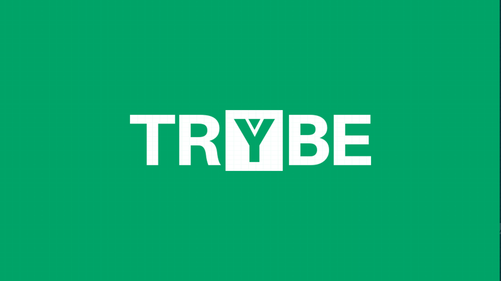

# Trybe - Escola de Desenvolvimento de Softwere
A Trybe é a escola que se compromete integralmente com o sucesso do aluno e acelera a sua carreira em aproximadamente 12 meses.

## Currículo
Na trybe é desenvolvido tanto os Skills, como os Soft skills. Segue o resumo do que aprendemos na Trybe

### Front-End
Aprende-se as linguagens *HTML, CSS, JavaScript e React*, bem como o controle de versionamento Git & GitHub;

### Back-end
Como toda aplicação precisa de um coração, a trybe ensina a construir esse coração e o cérebro do sistema que é o backend. Utilizando as linguagens: *Node.JS, SQL, Express.js*

### Introdução a Ciência de Computação
Aprendemos os conceitos de Ciência da Computação, sabendo utilizar os principais algoritmos para resolver problemas complexos. **(Python e Lógica)**

### Soft skills
Trabalhamos em equipe de forma colaborativa, assumindo responsabilidades, comunicando-se de forma eficiente e sabendo conciliar interesses.

### Rotinas de desenvolvimento
Nos ambientamos com a rotina de uma pessoa desenvolvedora de software, incluindo os processos de uma empresa de tecnologia e as melhores práticas de desenvolvimento e de controle de qualidade de software.

### Metodologias Ágeis
Aprendemos os conceitos, artefatos e cerimônias das metodologias ágeis, que nos capacita a trabalhar com naturalidade seguindo a metodologia.

# Sobre o repositório
Aqui está contido os exercícios realizados durante o curso. Desde a introdução e fundamentos da programção até o conteúdo final.

